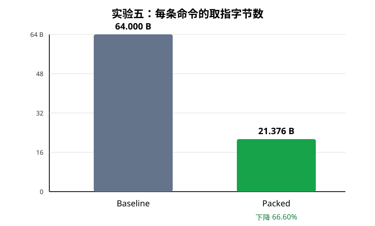

# 实验五：Command Packing

## 1. 实验目标

本实验把多条短命令紧凑地放入同一条 64 B 缓存行，降低 Command Processor（CP）的 Ring 取指流量，同时保持命令顺序、退役次数和 `seqnum` 语义不变。

以 `CMD_DCR_WRITE` 为例，每条命令实际只占 20 B。优化前每条命令独占 64 B，1000 条命令需要读取 1000 条缓存行；优化后每条缓存行最多容纳 3 条 DCR 命令，1000 条命令只需要 334 条缓存行。

## 2. 设计与实现

### 2.1 Runtime 缓存行构建器

修改文件：

- `sw/runtime/common/vortex2_internal.h`
- `sw/runtime/common/device.cpp`

Runtime 新增一条 64 B 待提交缓存行和当前已用字节数。加入命令时执行以下逻辑：

```text
剩余空间足够：把紧凑命令追加到当前缓存行
剩余空间不足：先 flush 当前缓存行，再把命令放入新缓存行
批处理结束：将最后一条未满缓存行补零并 flush
同步提交：加入命令后立即 flush，保持原有同步等待语义
```

命令的线上长度由命令类型决定：DCR 写/读为 20 B，Launch、Cache Flush、QMD 和 Draw 为 12 B，内存命令为 28 B。

### 2.2 `tail` 与 `seqnum` 的语义分离

优化前，一次 append 固定写入一条缓存行，因此 `tail` 和 `expected_seqnum` 可以同时递增。Packing 后两者必须分开：

- `cp_tail_`：每 flush 一条缓存行增加 64 B；
- `cp_expected_seqnum_`：每加入一条命令增加 1。

这样 Engine 每退役一条命令递增一次的 `seqnum`，才能与 Runtime 等待的目标值一致。1000 条 DCR 最终 `seqnum=1000`，而不是缓存行数量 334。

## 3. 正确性测试

### 3.1 验证场景总表

| 场景 | 输入与配置 | 主要检查点 | 通过标准 |
|---|---|---|---|
| V1：空缓存行 | 64 B 全零 | 零填充哨兵是否正确结束解析 | 输出 0 条命令 |
| V2：单条普通命令 | 1 条 12 B LAUNCH | opcode、flags、arg0 | 只输出 1 条且字段完全一致 |
| V3：单条 Profile 命令 | 1 条带 `F_PROFILE` 的 LAUNCH | 动态长度和 `profile_slot` | 解析为 20 B，profile 数据保持一致 |
| V4：混合命令 Packing | DCR_WRITE(20 B)+MEM_COPY(28 B) | 不同长度命令的偏移和参数 | 按原顺序输出 2 条，参数完全一致 |
| V5：多条 Profile 命令 | 3 条、5 条 Profile NOP | 连续变长命令及尾部填充 | 所有命令均输出，profile 数据不串位 |
| V6：空间不足 | 2 条 MEM_COPY 后在偏移 56 放置伪命令头 | 禁止命令跨越缓存行 | 只输出前 2 条，不解析越界命令 |
| V7：缓存行恰好放满 | 20+20+12+12=64 B | 最后一条命令结束位置 | 正确输出 4 条命令，无伪命令 |
| V8：多缓存行压力 | 1000 条 DCR，Packed 模式 | 连续 flush、取指次数和退役计数 | 334 CL、`seqnum=1000`、无丢失或重复 |
| V9：Baseline 对照 | 1000 条 DCR，每条独占一行 | 流量比较基线 | 1000 CL、64000 B、`seqnum=1000` |
| V10：Ring wrap Packing | 256 B Ring，每行 3 条 DCR，共 12 条 | 地址顺序、回绕、同一行多命令解析 | 4 次读取、12 条命令、最终逻辑 head=384 |
| V11：Completion 写回 | `retire_seqnum=42` | 完成序号写入 `cmpl_addr` | Host memory 中读回 42 |
| V12：相关模块回归 | `cp_dma`、`cp_engine`、Runtime stub | 新打包逻辑未破坏其他路径且 Runtime 可编译 | 所有测试和编译均 PASS |

### 3.2 Packing 边界

`cp_unpack` 单元测试新增了恰好放满一条缓存行的组合：

```text
DCR_WRITE(20 B) + DCR_WRITE(20 B) + LAUNCH(12 B) + LAUNCH(12 B) = 64 B
```

原有场景同时覆盖剩余空间不足、非法操作码、命令越界和多命令连续解析。测试结果为 `PASSED — 8 scenarios`。

### 3.3 Ring wrap

`cp_axi_path` 新增 256 B 小 Ring 回绕测试。每条缓存行打包 3 条 DCR，共解析 12 条命令。逻辑 head 从 128 开始连续取 4 条缓存行，物理 AXI 地址依次为：

```text
ring_base + 128
ring_base + 192
ring_base + 0
ring_base + 64
```

测试验证 12 条打包命令均被发出、只发生 4 次缓存行读取，最终逻辑 head 为 384，结果为 `PASSED — 4 scenarios`。

### 3.4 相关模块回归

| 回归项 | 结果 |
|---|---|
| `cp_unpack` | PASS，8 个场景 |
| `cp_axi_path` | PASS，4 个场景 |
| `cp_dma` | PASS，2 个复制场景和 23 个边界场景 |
| `cp_engine` | PASS，Smoke 与 NOP 性能场景 |
| Runtime stub 编译 | PASS，`libvortex.so` 构建成功 |

## 4. 1000 条 DCR_WRITE 结果

测试程序：`hw/unittest/cp_core/cp_core`

| 指标 | Baseline | Packed | 变化 |
|---|---:|---:|---:|
| Command Count | 1000 | 1000 | 不变 |
| Cache-Line Count | 1000 | 334 | -66.60% |
| CL/Command | 1.000 | 0.334 | -66.60% |
| Fetch Traffic | 64000 B | 21376 B | -66.60% |
| Bytes/Command | 64.000 B | 21.376 B | -66.60% |
| Total Cycles | 7011 | 7011 | 0% |
| Cmd/Cycle | 0.142633 | 0.142633 | 0% |
| Final Seqnum | 1000 | 1000 | 正确 |
| Dropped / Duplicate | 0 / 0 | 0 / 0 | 正确 |



原始输出保存在：

- `results/exp05/baseline.log`
- `results/exp05/packed.log`
- `results/exp05/packing_metrics.csv`

## 5. 结果分析

实测取指流量下降了：

```text
(64000 - 21376) / 64000 × 100% = 66.60%
```

Packed 结果的 334 条缓存行符合 `ceil(1000 / 3)`。最后一条缓存行包含 1 条 DCR 和 44 B 填充，因此平均值是 21.376 B/Command，略高于单条命令有效载荷 20 B。

本测试中总周期和吞吐没有变化。原因是当前模型里缓存行读取可与 DCR Engine 执行重叠，整体瓶颈是每条 DCR 的执行/退役路径，而不是 Ring Fetch 带宽。因此本实验可以证明前端流量减少和语义正确，但不能据此宣称 DCR 执行吞吐已经提高。预期收益会在 Host Memory 延迟更高、Fetch 带宽受限或多队列竞争更强的系统中更明显。

## 6. 实验结论

实验五达到完成条件：

- 一条 64 B 缓存行能够安全承载多条命令；
- 1000 条 DCR 的缓存行数和取指字节数下降 66.60%；
- `seqnum` 仍按命令计数，最终值为 1000；
- 无命令丢失、重复或顺序错误；
- 恰好放满、空间不足、多缓存行连续处理及 Ring wrap 均有测试覆盖；
- 相关 CP 单元测试和 Runtime 编译回归通过。
