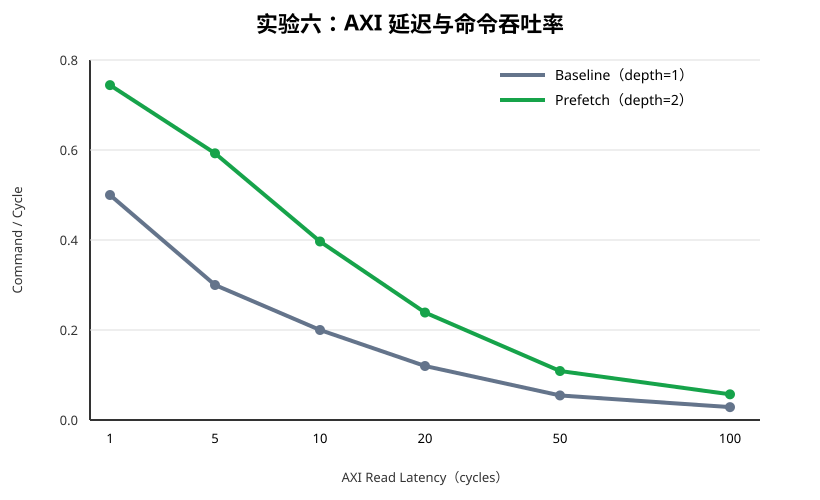

# 实验六：Fetch Prefetch

## 1. 实验目标

原 `VX_cp_fetch` 采用串行流程：发出一条缓存行读取、等待 AXI R、解包整行，随后才读取下一行。Host AXI 延迟无法与当前缓存行的处理重叠。

本实验加入固定深度为 2 的 Cache-Line FIFO，并允许最多两个有序 AXI 读请求在途，使请求、响应缓存和命令输出形成流水。

## 2. RTL 设计

修改文件：`hw/rtl/cp/VX_cp_fetch.sv`。

```text
Host AXI -> CL FIFO[write_ptr] -> CL FIFO[read_ptr] -> VX_cp_unpack
                 fetch_head          head
```

主要状态：

- `fetch_head_r`：下一次 AR 对应的逻辑 Ring 偏移；每次 AR handshake 增加 64；
- `head_r`：已经完成消费的逻辑 Ring 偏移；每次 FIFO 出队增加 64；
- `cl_fifo[2]`：保存当前行和预取行；
- `read_ptr_r`、`write_ptr_r`：FIFO 读写指针；
- `fifo_count_r`：已经返回的缓存行数量；
- `request_count_r`：已经发 AR、尚未收到 R 的请求数量。

发出新请求的容量约束为：

```text
fifo_count + request_count < PREFETCH_DEPTH
```

因此每个在途响应都有预留 FIFO 空间。第一版只支持深度 1 或 2，响应保持 AR 顺序，不增加乱序重排结构，也不使用复杂 AXI ID。

## 3. 验证场景

| 场景 | 输入 | 检查点 | PASS 标准 |
|---|---|---|---|
| Baseline 功能 | `PREFETCH_DEPTH=1` | 原单行路径兼容性 | `cp_axi_path` 4 场景通过 |
| Prefetch 功能 | `PREFETCH_DEPTH=2` | FIFO 入队、出队和双在途请求 | `cp_axi_path` 4 场景通过 |
| 连续缓存行 | 64 CL，每行 3 条 DCR | AR 数、地址、命令数和顺序 | 64 AR、192 命令，地址连续且命令有序 |
| Ring wrap | 256 B Ring，4 CL，每行 3 条 DCR | 128、192、0、64 的物理地址顺序 | 12 条命令，最终逻辑 head=384 |
| AXI 延迟扫描 | 1/5/10/20/50/100 cycles | Baseline 与 depth=2 吞吐 | 所有点正确，depth=2 吞吐更高 |
| 完整 seqnum | `cp_core` 1000 条 Packed DCR | Fetch 到 Engine 的退役计数 | `final_seqnum=1000`，无丢失或重复 |
| 相关回归 | unpack、engine、DMA | 未破坏其他 CP 路径 | 全部 PASS |

## 4. 延迟扫描结果

工作负载固定为 64 条缓存行，每行打包 3 条 DCR，共 192 条命令。`cmd_out_ready` 持续为 1。

| AXI 延迟 | Baseline Cycles | Baseline Cmd/Cycle | Prefetch Cycles | Prefetch Cmd/Cycle | 吞吐提升 |
|---:|---:|---:|---:|---:|---:|
| 1 | 384 | 0.500000 | 258 | 0.744186 | 48.84% |
| 5 | 640 | 0.300000 | 324 | 0.592593 | 97.53% |
| 10 | 960 | 0.200000 | 484 | 0.396694 | 98.35% |
| 20 | 1600 | 0.120000 | 804 | 0.238806 | 99.01% |
| 50 | 3520 | 0.054545 | 1764 | 0.108844 | 99.54% |
| 100 | 6720 | 0.028571 | 3364 | 0.057075 | 99.76% |



所有测试点均满足 `ar_count=64`、`commands=192`、`final_head=4096`，且 dropped/duplicate 均为 0。原始数据位于 `results/exp06/prefetch_latency_sweep.csv`。

## 5. 波形与正确性

关键波形为 `results/exp06/prefetch_wrap.vcd`，使用 depth=2 和 10-cycle AXI 延迟生成。波形覆盖 AR/R handshake、`request_count_r`、`fifo_count_r`、读写指针、连续缓存行以及 Ring wrap。

完整 `cp_core` 回归执行 1000 条 Packed DCR，结果为 `final_seqnum=1000`、`dropped_count=0`、`duplicate_count=0`。

## 6. 结果分析与结论

depth=1 每次只能等待一条缓存行，延迟直接串行累积。depth=2 可同时保持两条有序读取在途；当 Host AXI 延迟增大时，稳态吞吐逐渐接近 Baseline 的两倍。1-cycle 场景提升为 48.84%，100-cycle 场景提升达到 99.76%。

## 7. PPA 对照与集成决策

PPA 使用仅封装 `VX_cp_fetch` 的 `VX_cp_fetch_top`，两组输入采用相同工具、库和约束。FPGA 数据来自 Yosys 0.9 的 xc7 代理综合；ASIC 数据来自 NanGate 15 nm typical、400 MHz 映射目标和 OpenSTA。绝对值受旧版开源工具和未布局布线条件影响，主要用于同条件增量比较。

| 指标 | Depth=1 | Depth=2 | 变化 |
|---|---:|---:|---:|
| FPGA estimated LCs | 7915 | 7954 | +0.49% |
| FPGA FDRE | 137 | 141 | +4 |
| FPGA BRAM | 0 | 0 | 0 |
| ASIC cell area | 33953.304 µm² | 37645.650 µm² | +10.87% |
| Reg-to-reg arrival | 19.146 ns | 19.597 ns | +2.36% |
| Fmax proxy | 51.08 MHz | 49.92 MHz | -2.27% |

Fmax 按 `(arrival + setup) / (1 - uncertainty)` 换算；Baseline setup 为 0.040 ns，Prefetch setup 为 0.033 ns，clock uncertainty 为 2%。关键路径主要位于动态命令解包逻辑，因此绝对 Fmax 很低，但两组比较条件一致。

最终结论为：**功能与性能 Accept，默认集成暂缓**。2-entry 在高延迟下接近 2 倍吞吐，但 ASIC 面积增加 10.87%、Fmax 代理下降 2.27%。保留参数和实验实现，`VX_cp_fetch` 默认 `PREFETCH_DEPTH=1`；性能实验和后续优化可显式设为 2。

实验六达到功能完成条件：没有重复或跳过缓存行，命令顺序、Ring wrap、head 和 seqnum 均正确，并用六档可调 AXI 延迟证明了 2-entry Prefetch 的延迟隐藏效果。
