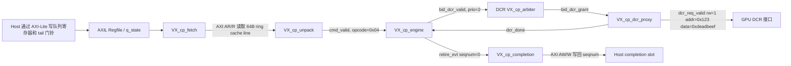

# 实验 1：CP DCR_WRITE 完整数据流与波形

## 实验结论

本次实验完成了 `CMD_DCR_WRITE` 从主机可见命令环到 completion 写回的端到端波形验证。实验只扩展了 `hw/unittest/cp_core/main.cpp` 里的 C++ testbench，让 `cp_core` 集成测试在 ring 中放入一条 `CMD_DCR_WRITE + F_PROFILE` 命令；没有修改 CP RTL。

主要产物如下：

| 文件 | 说明 |
|---|---|
| `results/exp01/cp_core_dcr_write.vcd` | DCR_WRITE 端到端 VCD 波形 |
| `results/exp01/cp_core_dcr_write.log` | DCR_WRITE 测试编译与运行日志 |
| `results/exp01/cp_core_dcr_write_timing.svg` | 从 VCD 事件抽取出的中文标注时序图 |
| `results/exp01/cp_core_end_to_end.vcd` | 修改 testbench 前的 NOP+F_PROFILE 对照波形 |
| `results/exp01/cp_core_end_to_end.log` | 修改 testbench 前的 NOP+F_PROFILE 对照日志 |

最终测试输出：

```text
PASSED - CP end-to-end: DCR_WRITE retired, dcr[0x123]=0xdeadbeef, seqnum=1 written to cmpl_addr
```

## 实验环境

| 项目 | 值 |
|---|---|
| Vortex 版本 | `VORTEX_VERSION=3.0` |
| 运行时 Git commit | `21b94dad9ed985abf157d25db571af20b9ff21ea` |
| Build 目录 | `/home/houdong/vortex/build` |
| Configure 参数 | `../configure --xlen=32 --tooldir=/home/houdong/vortex/build/tools` |
| XLEN | `32` |
| TOOLDIR | `/home/houdong/vortex/build/tools` |
| Verilator | `Verilator 5.046 2026-02-28 rev v5.046-55-g1264184fb` |
| Host 编译器 | `g++ 11.4.0` |

说明：运行时工作区不是干净状态，因为本实验有意修改了 `cp_core` C++ testbench，并新增了 `results/exp01/` 下的实验产物。

## CP 数据流



命令环中的 DCR_WRITE 编码如下：

```text
[0x00] opcode = 0x04 (CMD_DCR_WRITE)
[0x01] flags  = 0x01 (F_PROFILE)
[0x04..0x0b] arg0 = 0x123
[0x0c..0x13] arg1 = 0xdeadbeef
[0x14..0x1b] profile_slot = 0xcafebabe
```

`CMD_DCR_WRITE` 基础长度是 20 B，`F_PROFILE` 额外增加 8 B，所以 `VX_cp_unpack` 接收该命令后，fetch 侧记录的 `offset_r` 为 `0x1c`。

## 波形信号清单

| 阶段 | VCD 中使用的信号 |
|---|---|
| Doorbell / 队列状态 | `dbg_q0_tail`, `q_state[0].tail`, `g_cpe[0].u_fetch.state_in.tail` |
| Fetch | `g_cpe[0].u_fetch.head_r`, `offset_r`, `state`, `m_arvalid`, `m_arready`, `m_araddr`, `m_rvalid`, `m_rready` |
| Unpack 到 Engine | `cmd_out_valid`, `cmd_out_ready`, `cmd_out.hdr.opcode`, `cmd_out.profile_slot` |
| Engine | `u_engine.fsm`, `cmd_in_valid`, `cmd_in_ready`, `dcr_valid[0]`, `dcr_grant[0]` |
| DCR 仲裁器 | `u_arb_dcr.bid_valid[0]`, `u_arb_dcr.bid_priority[0]`, `u_arb_dcr.bid_grant[0]` |
| DCR proxy / GPU 侧 | `gpu_dcr_req_valid`, `gpu_dcr_req_rw`, `gpu_dcr_req_addr`, `gpu_dcr_req_data`, `dcr_done` |
| Completion | `retire_evt[0]`, `retire_ready[0]`, `retire_seqnum[0]`, `q_seqnum[0]`, `m_awvalid`, `m_awaddr`, `m_wvalid`, `m_wready` |

## 单命令事件表

VCD timescale 是 `1ps`。testbench 每个 timestamp tick 翻转一次 clock，因此下表主要用于说明相对顺序，不作为真实硬件时钟周期/频率结果。

| VCD 时间 | 事件 |
|---:|---|
| 41 ps | Tail doorbell 可见：`tail = 0x40` |
| 45 ps | Fetch 发出 host-memory AXI 读请求：`m_arvalid=1`, `m_araddr=0x1000` |
| 48 ps | Host memory 返回 64 B ring cache line：`m_rvalid=1` |
| 51 ps | Unpack 向 engine 输出命令：`cmd_valid=1`, `opcode=0x04`, `profile_slot=0xcafebabe` |
| 53 ps | Engine 进入 `S_DECODE`，`fsm=0x1`；fetch 记录 `offset_r=0x1c` |
| 55 ps | Engine 进入 `S_BID`，`fsm=0x2`；DCR bid 和 DCR grant 同时拉高 |
| 57 ps | Engine 在 grant 后进入 `S_WAIT_DONE`，`fsm=0x3` |
| 59 ps | DCR proxy 发出 DCR 写请求并完成：`rw=1`, `addr=0x123`, `data=0xdeadbeef`, `dcr_done=1` |
| 61 ps | Engine 进入 `S_RETIRE`，`fsm=0x4`，`retire_evt=1` |
| 63 ps | Completion 接收 retire：`retire_ready=1` |
| 65 ps | Engine 回到 idle，`q_seqnum[0]` 推进到 `1` |
| 69 ps | Completion 开始写回 host completion slot：`m_awvalid=1`, `m_awaddr=0x1200` |
| 71-73 ps | Completion 写数据通道完成 `m_wvalid/m_wready` 握手 |

## 遇到的问题

1. 指导书要求实验 1 跟踪完整 `CMD_DCR_WRITE` 路径，但仓库里原有 `cp_core` 单元测试使用的是 `CMD_NOP + F_PROFILE`。它能覆盖 `regfile -> fetch -> unpack -> engine -> completion`，但不会触发 DCR 仲裁器和 `VX_cp_dcr_proxy`。本次通过修改 C++ testbench 的 ring payload，把命令改为 `CMD_DCR_WRITE + F_PROFILE`，并新增 DCR 地址/数据断言，使实验内容与指导书目标对齐。
2. 不能用普通 `CMD_NOP` 做完整 fetch/unpack 链路验证，因为 `opcode=0, flags=0` 同时也是 cache line padding sentinel，会被 `VX_cp_unpack` 当成行结束。testbench 中继续保留 `F_PROFILE`，避免命令头被误判为 padding。
3. 当前 shell 环境里存在 `DEBUG=release`。如果该值透传给 CP Verilator Makefile，会生成 `-DVX_DBG_DEBUG_LEVEL=release`，导致 `VX_trace_pkg.sv` 中的 `release` 被当作 SystemVerilog token 解析并报语法错误。复现命令使用 `env -u DEBUG` 清掉它。
4. 当前环境没有安装 `ccache`，而 Verilator 生成的 Makefile 默认 `OBJCACHE ?= ccache`。复现命令使用 `OBJCACHE=` 禁掉该默认值，直接调用 `g++`。
5. 本次运行环境是命令行环境，没有生成 GUI 波形截图。可复现的波形证据是 `cp_core_dcr_write.vcd`；中文标注图 `cp_core_dcr_write_timing.svg` 和上面的事件表给出截图应标注的关键点。

## 如何复现

从干净 shell 执行：

```bash
cd /home/houdong/vortex/build
../configure --xlen=32 --tooldir=/home/houdong/vortex/build/tools
env -u DEBUG OBJCACHE= \
  VCD_FILE=/home/houdong/vortex/results/exp01/cp_core_dcr_write.vcd \
  make -C hw/unittest/cp_core clean run DEBUG=0 \
  > /home/houdong/vortex/results/exp01/cp_core_dcr_write.log 2>&1
```

预期日志中包含：

```text
PASSED - CP end-to-end: DCR_WRITE retired, dcr[0x123]=0xdeadbeef, seqnum=1 written to cmpl_addr
```

查看波形：

```bash
gtkwave /home/houdong/vortex/results/exp01/cp_core_dcr_write.vcd
```

如果没有安装 `gtkwave`，可以直接根据本文的“波形信号清单”和“单命令事件表”在 VCD 中搜索对应信号。
